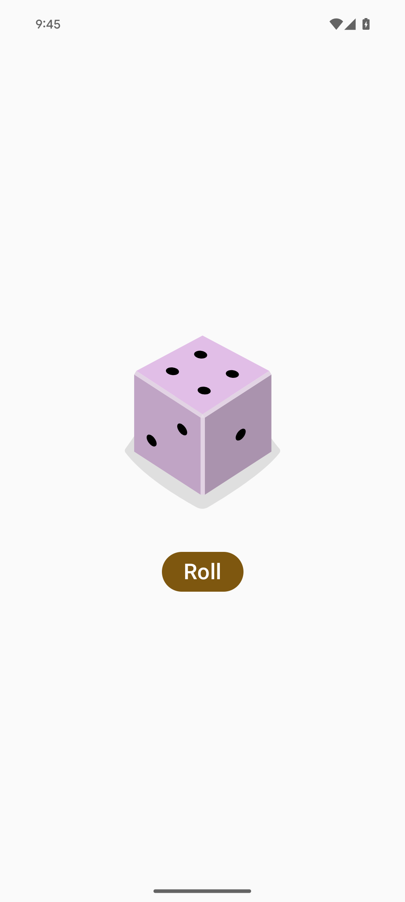

# Dice Roller

A simple dice roller app built for Android using Kotlin and Jetpack Compose.

## Features

- [x] With a single button press, users can roll the dice, and the results are displayed in real-time.
- [ ] Users can easily share their results via social media or messaging apps.

## Screenshot



## Getting Started

1. Clone the repository ```sh git clone https://github.com/uitangclan/dice-roller.git```
2. Open the project in Android Studio
3. Build and run the app on an emulator or a device

## Built With

- [Kotlin](https://kotlinlang.org/) - Programming language
- [Jetpack Compose](https://developer.android.com/jetpack/compose) - UI toolkit

## Authors

- **Yuji RZA** - [uitangclan](https://github.com/uitangclan)

## License

This project is licensed under the MIT License - see the [LICENSE.md](LICENSE) file for details

## Acknowledgments

- Inspired by the [Google Codelab on Android Basics with Compose](https://developer.android.com/courses/android-basics-compose/course)
